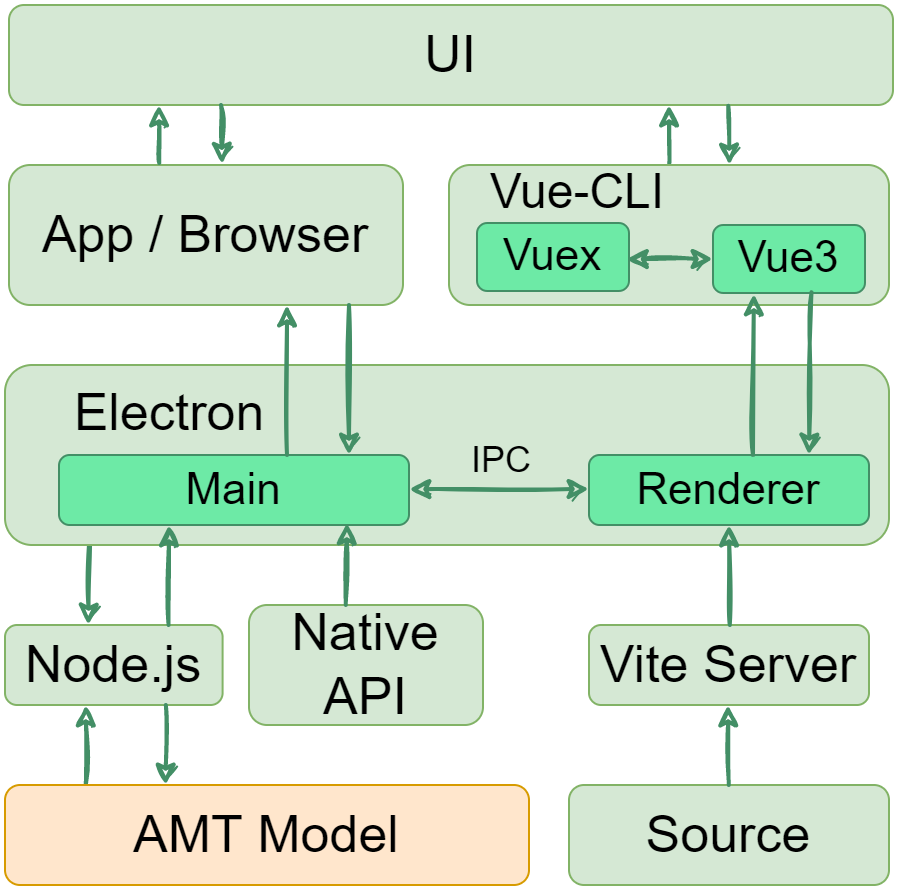
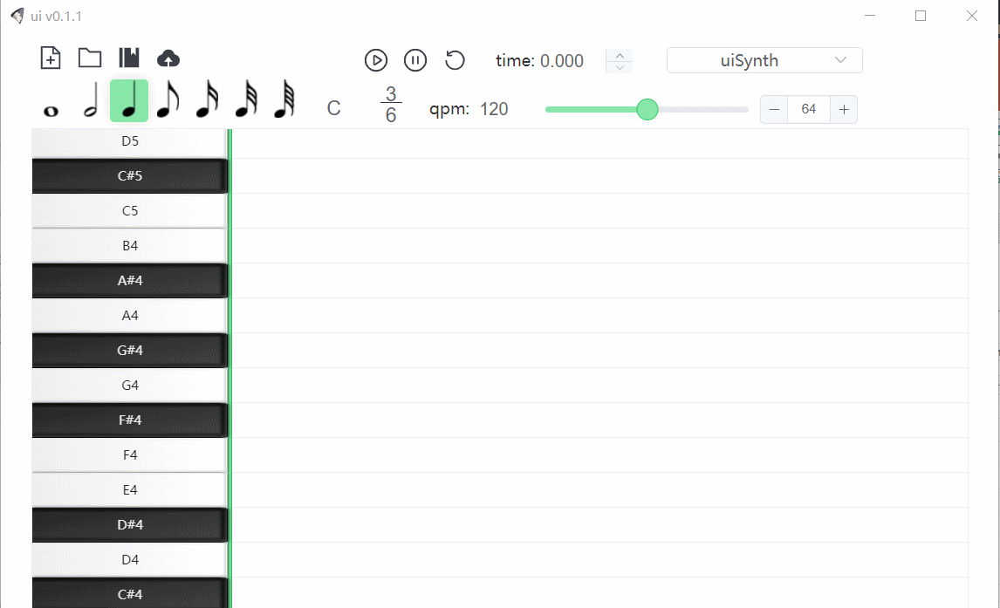
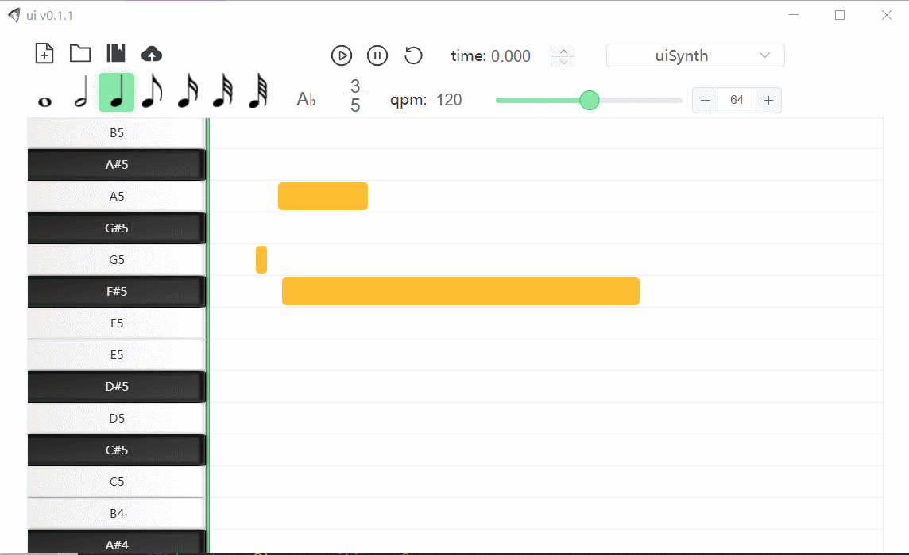
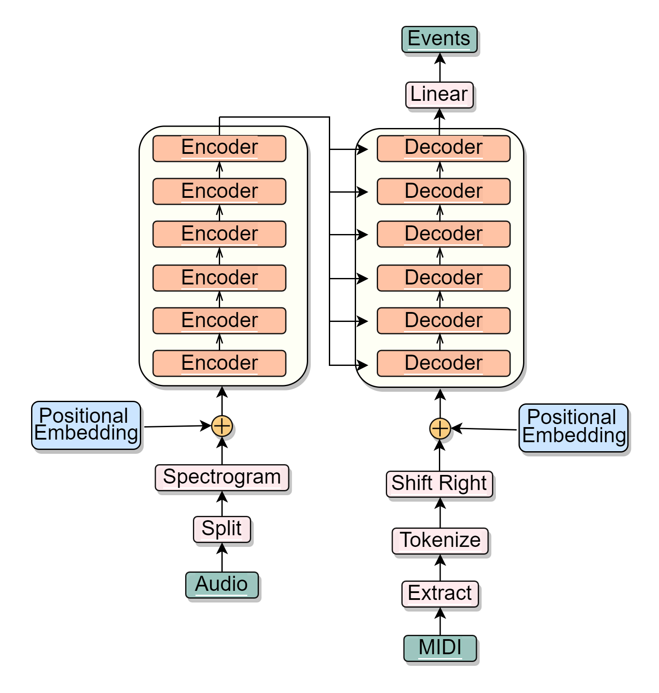

## Directory Structure
- ui: pianoroll editor, the UI of yui
- upr: some pianoroll matrices, can be opened by ui
- yui: a music transcription model based on Transformer
- yui_py37: the same code with yui, but in python 3.7 syntax, used in Colab and Kaggle


## UI
### What is it for
ui is a simple pianoroll editor that helps you convert the MIDI file into pianoroll matrix and export it into MIDI after modifying.  
With the help of [Tone.js](https://github.com/Tonejs/Tone.js), UI can play the pianoroll in real time.  

### Architecture
<div align=center>
  
</div>

### Preview
<div align=center>
  
</div>
<br/>
<div align=center>
  
</div>

### Supported Platforms
Windows 10 (maybe other versions can work too, but not tested)   
Linux (not tested)  
MacOS (not tested)  

### Installation
[windows installer](https://github.com/Stareven233/yui/releases) 

### Build
```
git clone git@github.com:Stareven233/yui.git
cd yui/ui   
npm install
```
run the following code corresponding to the OS  
```
npm run build:win  
npm run build:mac  
npm run build:linux 
```
Installer can be found in yui/ui/dist  

### With yui
Exporting MIDI and opening pianoroll in audio and MIDI format  
1. install ui
2. install yui
3. move yui/yui to the same level directory of ui


## YUI
### What is it for
yui can transcribe audio recodings into MIDI files, or be used to convert upr and MIDI to each other  
!you should train the model from scratch to activate the transcription function!

### Architecture
<div align=center>
  
</div>

### Installation
install python3
```
git clone git@github.com:Stareven233/yui.git
cd yui   
pip3 install -r requirements.txt
```

### Train
Not recommended, this model is slow to train and needs a graphics card with large memory  
Frankly, the model didn't work well in the practice after ten days' training  
Maybe the number of parameters is still insufficient  
Open yui/yui/train.py and modify the config if you still want to train it  

## Important!
- This is an undergraduate graduation project --"Acoustic Music Signal to Musical Notation Conversion Based on Deep Learning"
- Enjoy the whole functions of ui except transcribing audio into MIDI (although this is what the project developed for)
- Feel free to request support or submit a pull request 

